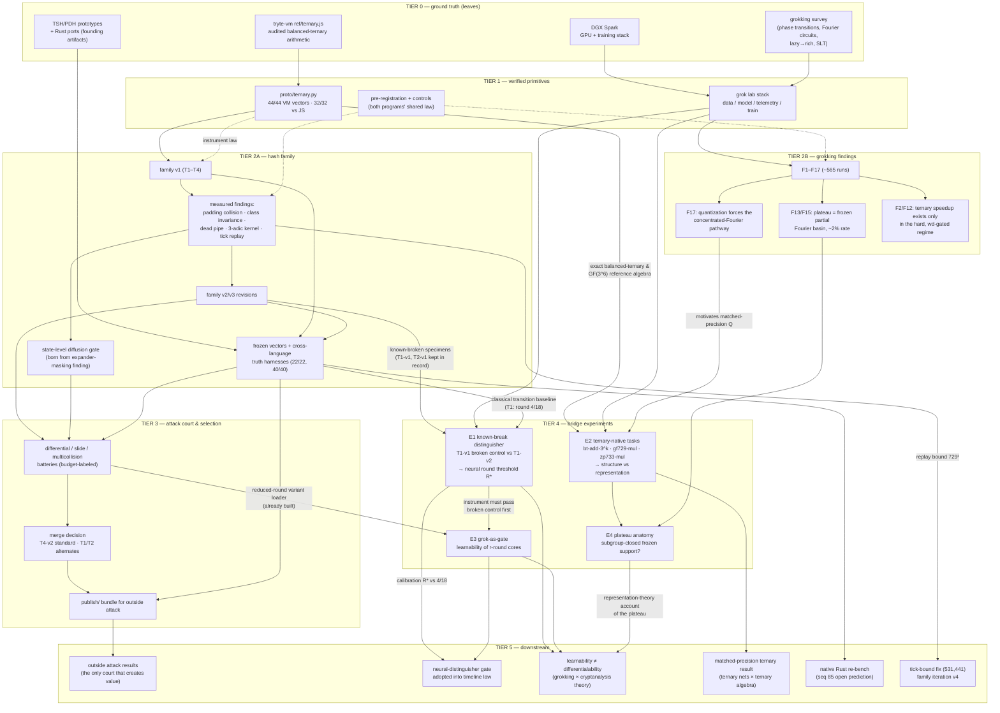

# RESEARCH DAG — the skill tree across both programs

*Two research programs, one dependency graph: the TSH-512 hash timeline
(this repo) and the grokking lab (`spark:~/workstation/lab/`), plus the
bridge experiments (E1–E4) that connect them. Every arrow is "depends
on". Dashed arrows are the cross-cutting discipline (pre-registration,
controls) that feeds every measurement. Rendered with Mermaid.*

## Reading the graph

**The spine** (leftmost path): audited arithmetic → verified port →
family → findings → revisions → court → merge → publish → outside
attack. This is the TSH-512 timeline's build order, complete through
seq 89.

**The load-bearing dependency nobody planned**: the state-level
diffusion gate exists *because* the dead-pipe finding proved digest
statistics are blind behind an expander. Gates in this program are
themselves discoveries, not design choices — that's why `STGATE` sits
downstream of `FIND1`, not beside it.

**The two bridges into Tier 4** are deliberately asymmetric:

- **E1** consumes the hash program's *specimens* (labeled broken
  controls — the thing neural-cryptanalysis papers never have) and the
  grok program's *instrument*. Its one hard dependency: the classical
  transition baseline (T1 round 4/18) so R\* has something to
  calibrate against. E1 gates E3 — never trust a learnability probe
  whose control hasn't separated.
- **E2** consumes the hash program's *algebra* (the exact GF(3⁶) /
  balanced-ternary reference that took a full phase to verify) and the
  grok program's *question* (F17: does quantization determine where
  solutions live — and does matched precision change the answer). E2
  gates E4.

**Critical path to new knowledge**: E1 tonight (everything it needs
exists today), then E3 in parallel with E2; E4 waits on E2's task
families. The longest path to *value* remains
`PUB → OUTATT` — no experiment here substitutes for outside attack.

**Orphan nodes (nothing depends on them yet)**: `NATIVE` (the seq-85
prediction that the Python economy ranking won't transfer to Rust) and
`TICK` (the 531,441 tick bound) — both are cheap, both are owed before
any deployment story, neither blocks the experiments.

## Node inventory (what exists vs what's proposed)

| Node | Status | Evidence |
|---|---|---|
| VM / PORT | done | timeline seq 22–23 |
| FAMV1 / FIND1 / FAMV2 | done | seq 26–47, 53 |
| STGATE | done | seq 51 pre-registration, 54/65/74 use |
| COURT / MERGE / PUB | done | seq 37–82, 87–89 |
| GFIND (F1–F17) | done | lab RESULTS.md, ~565 runs |
| E1–E4 | **proposed** | this document |
| NGATE / THEORY / MATCH | blocked on E1–E3 / E2 / E4 | — |
| OUTATT | open (outside world) | publish/ is live |
| NATIVE / TICK | open (owed) | seq 85, seq 53 |
